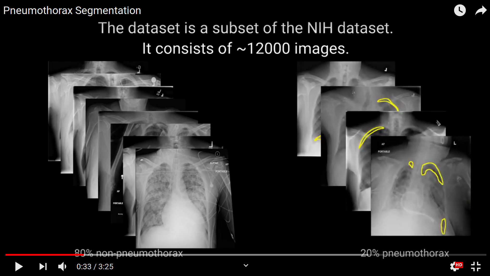

# Overview

Code for the [Kaggle Pneumothorax Segmentation Challenge](https://www.kaggle.com/c/siim-acr-pneumothorax-segmentation). Our team finished as 7th with a [dice score](https://www.kaggle.com/c/siim-acr-pneumothorax-segmentation/overview/evaluation) of `0.8629`. The following image shows the predictions of our final model. Non pneumothorax X-rays are shown in green. Predicted pneumothoraces are outlined in red.

<p align="center"> 
  
</p>

# Setup
The training data can be downloaded from here:
https://www.kaggle.com/seesee/siim-train-test

The stage 1 test images and labels will be added to the training data.

Requirements:
```console
pip install --upgrade pydicom tqdm opencv-python==3.4.5.20 albumentations==0.3.0 timm --user
```

Install `apex` for your system setup as explained here: https://github.com/NVIDIA/apex

```console
$ ls | grep dicom
>>> dicom-images-test dicom-images-train
```

# Training & Predictions
```console
$ cp Model_000_f00/*.py .
$ python train.py
$ cp Model_001_f00/*.py .
$ python train.py
$ cp Model_002_f00/*.py .
$ python train.py
```

This will produce the weights `Model_00*_f0*/*.pth` and test predictions `Model_00*_f0*/f0*-PREDS.zip`.

# Ensemble

```console
$ python ensemble_all.py
```

# Demo Video

You can find a short overview of our entry on YouTube:

<p align="center">
  <a href="https://youtu.be/fhr25lFClkw">
      
  </a>
</p>